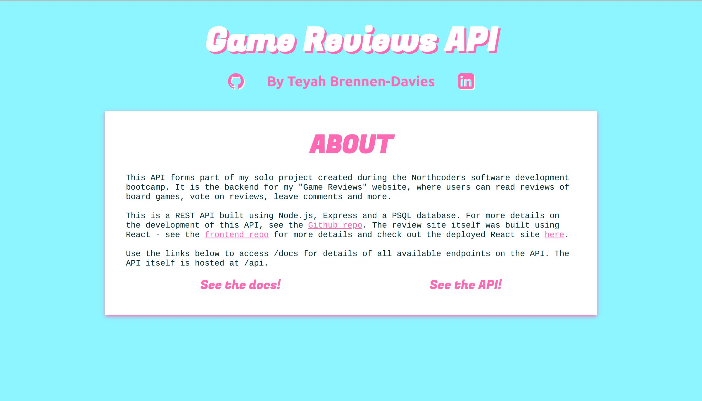
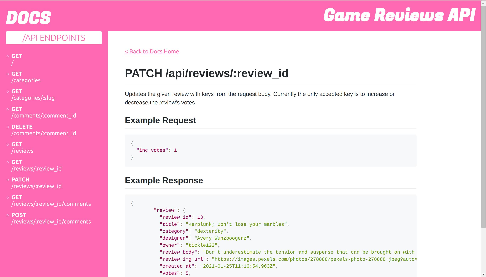
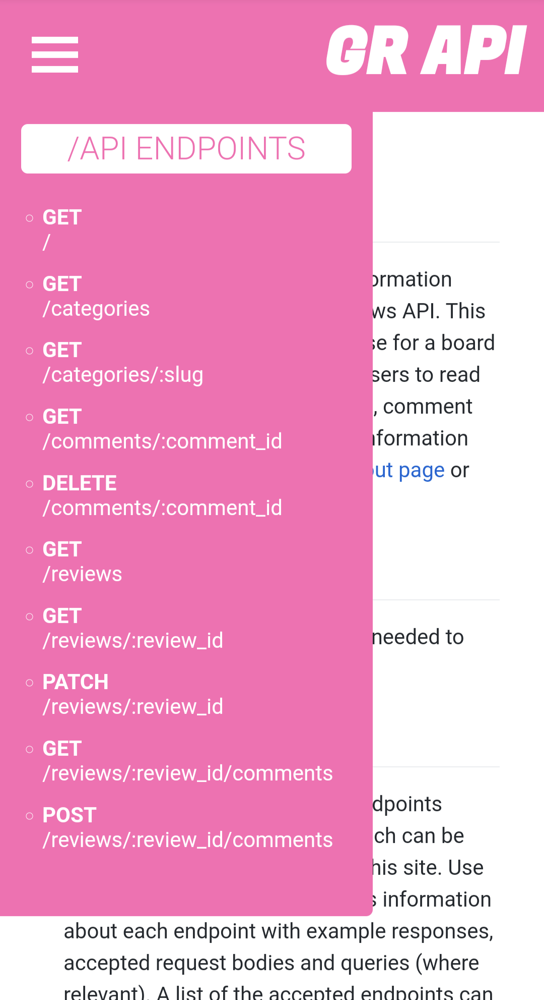

# Game Reviews API

This API was created as a solo project for the backend section of the Northcoders software development bootcamp. The repo contains an Express REST API that interacts with a PostgreSQL database to form the backend of a [board game review site](https://nc-board-game-reviews.netlify.app/) built in React.

The API has also has a [frontend interface](https://nc-games-reviews.onrender.com/) written with HTML, CSS, Markdown and JavaScript - the landing page contains an "About" section which links to both the API as well as a [Docs](https://nc-games-reviews.onrender.com/docs) section. This section contains a list of all possible endpoints on the API with details about the responses and request format (where relevant).

## Quick Links

- [Hosted API](https://nc-games-reviews.onrender.com/)
- [Hosted Frontend React Site](https://nc-board-game-reviews.netlify.app/)
- [Frontend Repo](https://github.com/teyahbd/nc-games-reviews)

## Built With

Key frameworks and packages used in the development of this API include:

- [Node.js](https://nodejs.org/en/)
- [PostgreSQL](https://www.postgresql.org/)
- [Express](https://expressjs.com/)
- [Jest](https://jestjs.io/)
- [Supertest](https://www.npmjs.com/package/supertest)

## Getting Started

You can get started using a local version of this API by following these steps:

### Prerequisites

- Node.js (min. v18.7.0)
- PostgreSQL (min. v14.5)
- npm (min. v8.15.0)

### 1. Clone this repo

You can clone this repo locally using the command:

```
git clone https://github.com/teyahbd/nc-games-reviews-api.git
```

### 2. Install dependences

Navigate into the main folder of this repo and install the necessary dependencies using the command:

```
npm install
```

### 3. Create local .env files

In order to connect to the test and development databases locally, you will need to create a `.env` file for each database containing the appropriate environment variable.

For the test database, create a new file in the main project directory named `.env.test` and add the line

```
PGDATABASE=nc_games_test
```

For the development database, create a similar file named `.env.development` with the line

```
PGDATABASE=nc_games
```

Ensure these new `.env` files are included in your `.gitignore` file.

### 4. Create and seed your local database

This API uses a PSQL database to store and update information. To create this database locally, run the setup script with the command:

```
npm run setup-dbs
```

To seed this database after creation, run the seeding script with the command:

```
npm run seed
```

Now you're ready to use the API!

### 5. Run the server locally

To run the server with the development data, use the command:

```
npm start
```

to locally host your own version of the API. The API is set up to run on PORT 9090. You can now interact with the API while the server is running using software such as `Insomnia`.

## API Usage

<div align="center">
  
  
  
</div>

The [hosted version](https://nc-games-reviews.onrender.com/) of this API contains a docs section which includes details of all current endpoints used in this API. The docs for this API can be found [here](https://nc-games-reviews.onrender.com/docs). At this time, interacting with the API does not require authentication.

## Testing

All endpoints (and error handling) on this API have been tested using `Jest` and `Supertest`. The test file can be found in the `__tests__` folder alongside some function testing. To run these tests for yourself, ensure you've followed the installation procedure above and run the test script with the command:

```
npm test
```

This command can be followed by a specific file name if you only wish to run one at a time.
